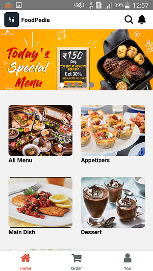
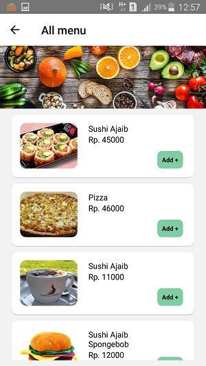
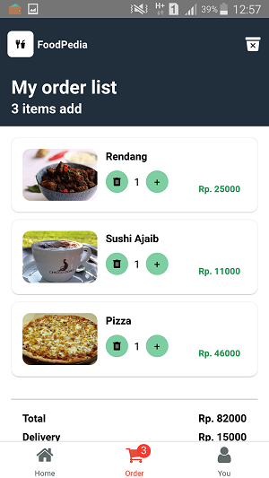
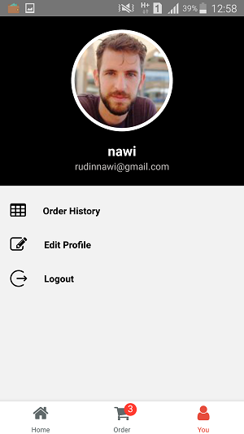

<h1 align="center">FoodPedia</h1>

Built with React Native

## Table of Contents

- [Table of Contents](#table-of-contents)
- [Introduction](#introduction)
- [Features](#features)
- [Requirements](#requirements)
- [Usage for development](#usage-for-development)
- [Screenshots](#screenshots)
- [Release APK Debug](#release-apk-debug)
- [Contributors](#contributors)

## Introduction
<b>FoodPedia</b> is a mobile application (android) that is used to help users order food without have to come directly to the restaurant. This application can also be used to add, change, and delete menus.

## Features
* User must sign in before use this app
* User can order some foods
* Admin can add, modify, delete and edit menus.
* And others

## Requirements
* [`npm`](https://www.npmjs.com/get-npm)
* [`react-native`](https://reactnative.dev/)
* [`React-Native-cli`](https://reactnative.dev/docs/environment-setup)

## Usage for development
1. Open your terminal or command prompt
2. Type `https://github.com/NawiOne/FoodPedia.git`
3. Open the folder and type `npm install` for install dependencies
4. Type `npm run android` for run this app. Make sure your device is connected with debugging mode.

## Screenshots

     
    
    
    

## Release APK Debug

## Contributors

  <table>
    <tr>
      <td align="center">
        <a href="https://github.com/NawiOne">
           
          <b>Nawirudin</b>
        </a>
      </td>
    </tr>
  </table>

